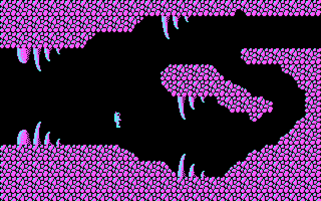

# Planetonomy

[](https://travis-ci.org/AMDmi3/planetonomy)

Old-school platformer/exploration game with CGA graphics

You are a member of space exploration mission to a planetoid with
unusual properties passing near earth. After successfull touchdown
your are left in the landing module to control communications and
look after other systems, while you compares go outside to explore
the planetoid. After some time, signal from survey team is suddenly
lost. Now you are alone to save them and uncover the mysteries of
strange space object.



## Building

Dependencies:

* cmake
* SDL2
* SDL2_image
* pugixml

The project also uses libSDL2pp, C++11 bindings library for SDL2.
It's included into git repository as a submodule, so if you've
obtained source through git, don't forget to run ```git submodule
init && git submodule update```.

To build the project, run:

```
cmake . && make
```

## Author

* [Dmitry Marakasov](https://github.com/AMDmi3) <amdmi3@amdmi3.ru>

## License

* Code: GPLv3 or later, see COPYING
* Assets: [Creative Commons Attribution-ShareAlike 4.0 International License](http://creativecommons.org/licenses/by-sa/4.0/)

The project also bundles third party software under its own licenses:

* extlibs/libSDL2pp (C++11 SDL2 wrapper library) - zlib license
